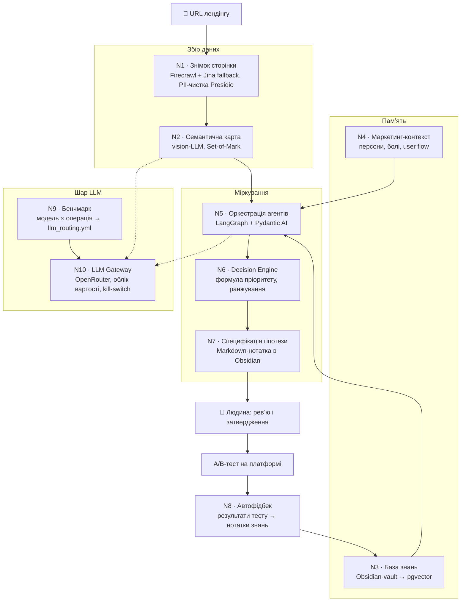

# ai-agent-system — мультиагентна LLM-система, що аналізує лендінги й пише ранжовані гіпотези для A/B-тестів

> **TL;DR (EN):** Design-first multi-agent LLM system that audits lead-gen landing pages and drafts ranked A/B-test hypotheses for human review. 10-node architecture: LangGraph + Pydantic AI orchestration, FastAPI, PostgreSQL/pgvector, self-hosted Firecrawl, Obsidian as a git-backed knowledge vault. Every node got a research doc before code; 5 of 10 nodes already expose wired REST endpoints, the rest are specified.

**Це design-first проект:** спершу архітектура цілком — 13 research-документів, схема на 10 вузлів, контракти API, — і лише потім код. Реалізація на ранній стадії, і README це не приховує (див. [Стан проекту](#стан-проекту)).

---

## Що це таке, простими словами?

Уяви лендінг — сторінку, куди люди потрапляють з реклами, — як вітрину магазину: від того, що в ній виставлено, залежить, зайде людина чи пройде повз. Власник вічно вагається: перефарбувати кнопку? переписати заголовок? Чесну відповідь дає *A/B-тест* — половині відвідувачів показують стару версію, половині нову, і порівнюють цифри.

Ця система — консиліум із десяти «спеціалістів», який готує такі експерименти. Один фотографує сторінку і складає опис, що де розташовано; другий памʼятає все, що вже пробували — нотатки лежать в Obsidian звичайними Markdown-файлами, а для пошуку за змістом проіндексовані у *векторній базі* pgvector (пошук за схожістю смислу, а не збігом слів); ще кілька агентів сперечаються, що варто змінити, а суддя ранжує їхні ідеї за формулою пріоритету. На виході — не змінена сторінка, а *гіпотеза*: «зробимо X — конверсія зросте, бо Y», записана людською мовою. Людина її читає, править або відхиляє — і тільки тоді зміна їде в тест, а результат тесту повертається в ту саму памʼять, тож наступні поради спираються вже й на нього.

## Архітектура: 10 вузлів



| Вузол | Призначення |
|---|---|
| **N1** | Browser & Snapshot — Firecrawl + витяг DOM/скриншотів/асетів + PII-санітизація |
| **N2** | Semantic Role Mapping — vision-LLM із технікою Set-of-Mark |
| **N3** | Knowledge System — Obsidian → pgvector з ієрархією авторитетності джерел |
| **N4** | Marketing Context — AI-чернетки персон, болей, user flow |
| **N5** | Multi-Agent Orchestration — LangGraph + Pydantic AI |
| **N6** | Decision Engine — формула пріоритету + ранжований вивід |
| **N7** | Hypothesis Builder — структурована специфікація → Obsidian Markdown |
| **N8** | Auto Feedback Loop — результати експериментів → нотатки знань |
| **N9** | Benchmark Harness — порівняння «модель × операція» |
| **N10** | LLM Gateway — роутинг через OpenRouter + облік вартості + kill-switch |

## Можливості

- **10 вузлів архітектури**, з них 5 уже мають підключені REST-роутери: `/api/v1/snapshots` (N1), `/api/v1/semantic` (N2), `/api/v1/knowledge` (N3), `/api/v1/marketing/contexts` (N4), `/api/v1/admin/cost` (N10) — плюс `/health` і `/version`.
- **Знімок лендінгу**: self-hosted Firecrawl із fallback на Jina Reader; персональні дані (PII) вирізаються Presidio до того, як HTML побачить LLM.
- **База знань**: Obsidian-vault → вотчер на файлові зміни → чанки → ембеддинги → pgvector; git-операції з vault — через `subprocess` і системний git.
- **Роутинг LLM як конфіг**: `configs/llm_routing.yml` мапить 8 операцій (semantic_extractor, judge, drafter…) на моделі й температури (від 0.0 у judge до 0.3 у drafter) + fallback-модель.
- **Домени**: home improvement (15+ субніш — walk-in tubs, roofing, flooring…) + dating; схема розрахована на додавання нових.
- **13 research-документів** у [`research/`](./research/) — по одному на вузол, плюс синтез і доменне дослідження лендінгів.
- **Тести на 3 рівнях**: unit / integration (Testcontainers з реальним Postgres) / agent_quality (golden snapshots); mypy strict, ruff із 13 групами правил.
- **Локальний стек одним `make up`**: 6 сервісів у docker-compose — застосунок, Postgres+pgvector, Firecrawl API, Playwright, Redis і окремий Postgres для черги Firecrawl.

## Чому це цікаво технічно

- **Research-first зі слідами в коді.** Кожен вузол має research-док до першого рядка коду, з правилом R1: «знайди готове OSS/SaaS, кастом — лише де його нема». Наслідки видно в `pyproject.toml`: `python-statemachine` замість `transitions`, `selectolax` (Lexbor) замість BeautifulSoup, GitPython викинутий на користь `subprocess` — через 70 МБ залежності й витоки file handles на Windows.
- **Вибір моделі — конфіг, не код.** Усі виклики LLM ідуть через один шлюз (N10) на OpenRouter; `llm_routing.yml` генерується бенчмарк-скриптом (`scripts/run_benchmark.py`), а не редагується на око. У шлюзі — облік вартості на операцію і kill-switch.
- **Human-in-the-loop без окремого UI.** Гіпотези і знання — Markdown-файли в Obsidian-vault: затвердження = правка файлу, `watchdog`-вотчер підхоплює зміну і переіндексовує її в pgvector. Черга ревʼю з git-історією — без жодного рядка фронтенду.
- **Дрібниці, які зазвичай зʼїдають день.** Перші рядки `main.py` перемикають event loop на Windows (async psycopg3 несумісний із ProactorEventLoop); Playwright-сервіс Firecrawl у compose обмежений 2.5 ГБ памʼяті з коментарем, чому саме.

## Як запустити

Потрібні ключі в `.env`: `OPENROUTER_API_KEY`, `INTERNAL_API_KEY`, `LANGSMITH_API_KEY` (шаблон — у `.env.example`).

### З Docker (повний стек)

```bash
# 1. Налаштування
cp .env.example .env
# впиши ключі в .env

# 2. Запуск
make up         # docker compose up -d --build
make logs       # логи застосунку

# 3. Перевірка
curl http://localhost:8001/health

# 4. Зупинка
make down
```

### Без Docker

```bash
# 1. Встановлення
make install    # pip install -e ".[dev,benchmark]"

# 2. Postgres із pgvector
docker run -d --name pg-local -p 5432:5432 \
  -e POSTGRES_PASSWORD=postgres pgvector/pgvector:pg16

# 3. Міграції
make migrate    # alembic upgrade head

# 4. Запуск
make dev        # uvicorn з reload на порту 8001
```

### Тести і перевірки

```bash
make test       # unit-тести
make test-int   # integration (Testcontainers)
make lint       # ruff check
make type       # mypy strict
make help       # всі цілі Makefile
```

## Структура репозиторію

```
ai-agent-system/
├── research/                 # 13 research-доків: N1–N10 + синтез + доменне дослідження
├── src/ai_agent_system/
│   ├── main.py               # FastAPI entrypoint, wiring вузлів
│   ├── config.py             # Pydantic Settings
│   ├── auth.py               # внутрішній API-ключ
│   ├── api/                  # роутери: snapshot, semantic, knowledge, marketing, admin_cost
│   ├── snapshot/             # N1 — Firecrawl-провайдер + Jina fallback
│   ├── semantic/             # N2 — семантична карта сторінки
│   ├── knowledge/            # N3 — інгест vault + pgvector
│   ├── marketing/            # N4 — маркетинг-контекст
│   ├── product_director/     # N5 — оркестрація (в роботі)
│   ├── hypotheses/           # N7 — специфікації гіпотез (в роботі)
│   ├── benchmark/            # N9 — порівняння моделей
│   ├── llm/                  # N10 — роутер OpenRouter + облік вартості
│   ├── db/                   # SQLAlchemy: сесії, моделі
│   ├── observability/        # трейсинг
│   └── page_works/
├── configs/llm_routing.yml   # модель + температура на кожну операцію
├── alembic/                  # міграції БД
├── tests/                    # unit / integration / agent_quality
├── docker-compose.yml        # 6 сервісів локального стеку
├── Makefile                  # make help — список команд
└── pyproject.toml
```

## Стан проекту

Порядок свідомий: спершу зафіксувати архітектуру й дослідження, потім нарощувати вузли. Репозиторій — знімок цього етапу (один коміт).

**Написано й підключено:**
- FastAPI-сервіс: `/health`, `/version` + роутери вузлів N1–N4 і N10
- Інгест Obsidian-vault у pgvector з live-вотчером на зміни файлів
- docker-compose стек (6 сервісів), Alembic-міграції, конфіг роутингу LLM
- Тести трьох рівнів у `tests/`, mypy strict, ruff

**У роботі / прототип:**
- N5–N7: модулі `product_director/` і `hypotheses/` існують у коді, але їхні API-роутери ще закоментовані в `main.py` — заплановані на наступні спринти
- N8 (автофідбек): research завершений, сервісного коду ще нема
- N9: бенчмарк-скрипт уже згенерував `llm_routing.yml`; харнес як сервіс — ще ні

**Чого нема:**
- Інтеграції з A/B-платформою (план: Java Spring Boot продукт на GrowthBook, через REST) — поки система повністю standalone
- CI/CD і деплою
- 15 alignment-документів, на які посилалась рання документація, живуть поза цим репозиторієм

## Ліцензія

Proprietary. Internal use only.
